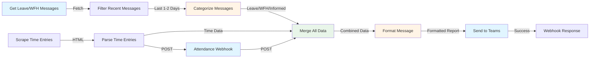

# DS Meeting Automation - n8n Workflow

An automated n8n workflow that generates and posts daily DS (Daily Standup) meeting reports to Microsoft Teams. This workflow collects attendance data, categorizes leave/WFH messages, scrapes time entries, and generates a formatted report automatically.


## 📋 Features

### 1. **Automated Data Collection**
   - **Microsoft Teams Integration**: Automatically fetches messages from the "Leave and WFH Updates" Teams channel
   - **Time Entry Scraping**: Scrapes time entry data from the project management system
   - **Attendance Webhook**: Accepts manual attendance input via webhook

### 2. **Intelligent Message Categorization**
   - **AI/Keyword-Based Analysis**: Categorizes Teams messages into:
     - **Leave**: Sick leave, holiday, personal leave, emergency leave, casual leave
     - **Work from Home (WFH)**: Remote work, client office, WFH requests
     - **Informed**: Late arrivals, traffic delays, unavoidable circumstances
   - Filters messages from the last 1-2 days automatically

### 3. **Smart Attendance Management**
   - Calculates **Present** members from webhook input
   - Determines **Absent** members (not present, not on leave/WFH, not informed)
   - Tracks **Leave** and **Work from Home** statuses
   - Identifies **Informed** members with reasons

### 4. **Time Entry Tracking**
   - Scrapes time entry data from project cost reports
   - Identifies members with missing time entries on the last working day
   - Cross-references attendance with time entry records

### 5. **Automated Report Generation**
   - Generates formatted daily standup reports with:
     - PM Scrum Date
     - Present in DS
     - Informed (with reasons)
     - Absent in DS
     - Leave
     - Work from Home/Client Office
     - Time Entry missing on the last working day
   - Automatically posts the report to Microsoft Teams

## 🔄 Workflow Diagram



## 🏗️ Workflow Architecture

### Node Breakdown

1. **Attendance Webhook** (`webhook-attendance`)
   - Receives POST requests with attendance data
   - Accepts present members list and all group members

2. **Get Leave/WFH Messages** (`teams-get-messages`)
   - Connects to Microsoft Teams API
   - Fetches all messages from the specified channel
   - Filters by channel ID from environment variables

3. **Filter Recent Messages** (`filter-recent-messages`)
   - Filters messages from the last 1-2 days
   - Uses JavaScript date comparison

4. **Categorize Messages (AI/Keyword)** (`ai-analyze-messages`)
   - Analyzes message content using keyword matching
   - Categorizes into: Leave, WFH, Informed, or Unknown
   - Can be enhanced with Hugging Face API for AI-based categorization

5. **Scrape Time Entries** (`scrape-time-entries`)
   - HTTP GET request to project cost reports URL
   - Retrieves HTML content with time entry data

6. **Parse Time Entries** (`parse-time-entries`)
   - Parses HTML using Cheerio
   - Extracts user names and their time entry hours
   - Returns structured data

7. **Merge All Data** (`merge-data`)
   - Combines all data streams:
     - Attendance data
     - Categorized messages
     - Time entry data

8. **Format Message** (`format-message`)
   - Generates formatted report text
   - Calculates absent members
   - Identifies missing time entries
   - Structures the final message

9. **Send to Teams** (`send-teams-message`)
   - Posts formatted message to Microsoft Teams channel
   - Uses Microsoft Teams API

10. **Webhook Response** (`webhook-response`)
    - Returns success response to webhook caller

## 🚀 Setup Instructions

### Prerequisites

1. **n8n Installation**: Ensure n8n is installed and running
2. **Microsoft Teams OAuth2**: Configure Microsoft Teams credentials in n8n
3. **Environment Variables**: Set the following in n8n:
   - `TEAMS_CHANNEL_ID`: Target Teams channel ID for posting reports
   - `TEAMS_LEAVE_WFH_CHANNEL_ID`: Source channel ID for Leave/WFH messages
   - `HUGGING_FACE_API_KEY` (Optional): For AI-based message categorization

### Installation Steps

1. **Import Workflow**
   ```bash
   # In n8n UI, go to Workflows > Import from File
   # Select ds-meeting-automation.json
   ```

2. **Configure Microsoft Teams Connection**
   - Go to Credentials > Add Credential > Microsoft Teams OAuth2 API
   - Follow the OAuth2 setup process
   - Grant required permissions:
     - `ChannelMessage.Read.All`
     - `Chat.Read.All`
     - `Team.ReadBasic.All`
     - `Subscription.ReadWrite.All`

3. **Set Environment Variables**
   - In n8n settings, configure:
     - `TEAMS_CHANNEL_ID`: Your target channel ID
     - `TEAMS_LEAVE_WFH_CHANNEL_ID`: Your Leave/WFH channel ID

4. **Configure Webhook URL**
   - Note the webhook URL from the "Attendance Webhook" node
   - Use this URL to send attendance data

5. **Test the Workflow**
   - Trigger the webhook with sample attendance data
   - Verify the report is generated and posted to Teams

## 📤 Usage

### Triggering the Workflow

Send a POST request to the Attendance Webhook URL:

```json
{
  "present": ["John Doe", "Jane Smith"],
  "allMembers": [
    "John Doe",
    "Jane Smith",
    "Bob Johnson",
    "Alice Williams"
  ]
}
```

### Expected Output

The workflow will generate and post a formatted report to Teams:

```
PM Scrum Date: 18 Nov 2025

-----------------------------------------

Present in DS
John Doe
Jane Smith

Informed
Bob Johnson (Stuck in traffic...)

Absent in DS
Alice Williams

Leave
None

Work from Home/Client Office
None

Time Entry is missing on the last working day
Alice Williams
```

## 🔧 Customization

### Adding More Members

Update the `allMembers` array in the webhook payload or modify the default member list in the "Format Message" node.

### Enhancing Message Categorization

The workflow supports AI-based categorization using Hugging Face API. To enable:

1. Set `HUGGING_FACE_API_KEY` environment variable
2. Modify the "Categorize Messages" node to use the API
3. Update the categorization logic as needed

### Modifying Report Format

Edit the "Format Message" node's JavaScript code to customize the report structure and content.

## 📝 Notes

- The workflow filters messages from the last 1-2 days automatically
- Time entry scraping requires the project URL to be accessible
- The workflow assumes a specific HTML structure for time entry tables
- All date formatting uses `en-GB` locale (DD MMM YYYY format)

## 🤝 Contributing

Feel free to submit issues or pull requests to improve this workflow.

## 📄 License

This project is open source and available for use.

---

**Repository**: [Ds-Mettiing-n8n-automation](https://github.com/mahedi-h-rif/Ds-Mettiing-n8n-automation-)
